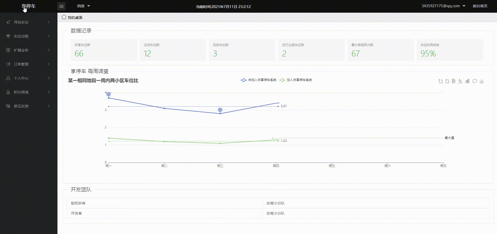
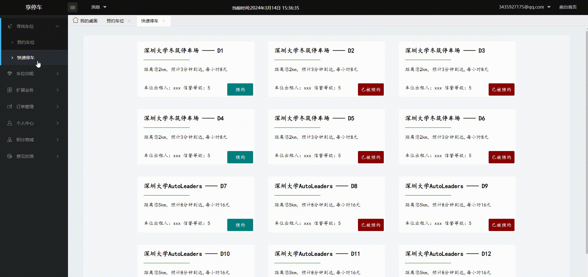
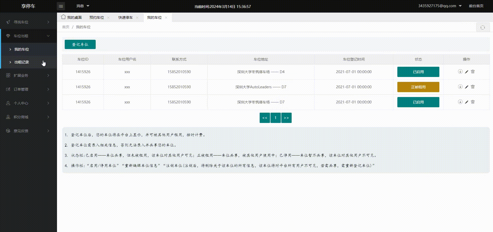
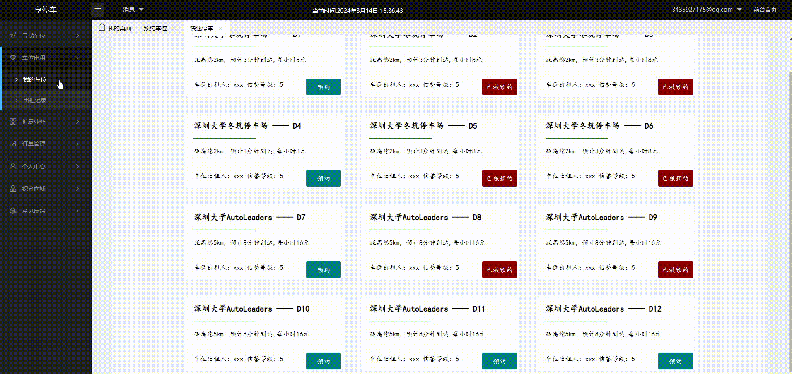
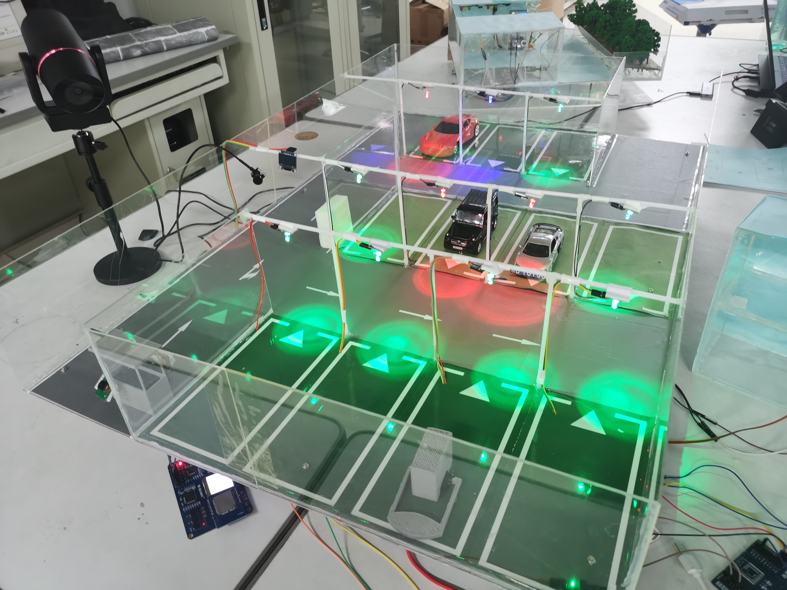

# Smart_Shared_Parking_System (Based_on_HuaweiCloud)
### Competition works
The work includes software and hardware parts, and currently only the modeling part done at that time and the implementation plan for QR code recognition in the password cabinet have been uploaded;\
Due to technical issues with some documents, they will be compiled and continuously updated in the future!

## 项目介绍
本套智慧共享停车系统是一个基于物联网技术，创新研发出集预约，共享，管理停车三大功能的一套新科技系统。它能够将闲置的车位利用共享出来，解决城市不同区域停车位昼夜利用率差别大，停车位管理困难以及停车体验不佳等问题，为城市停车提供崭新的解决方案。
## 系统网页展示
### 初始页

### 预约停车

### 记录查询

### 共享车位

## 项目沙盘模型

